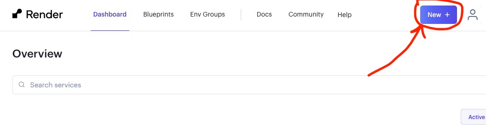
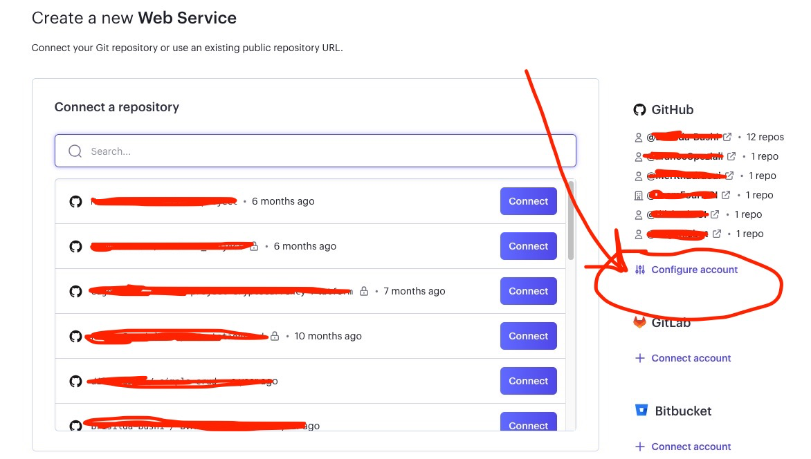
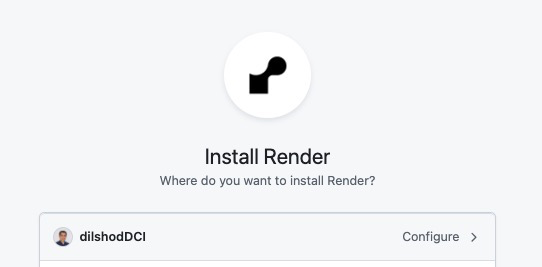
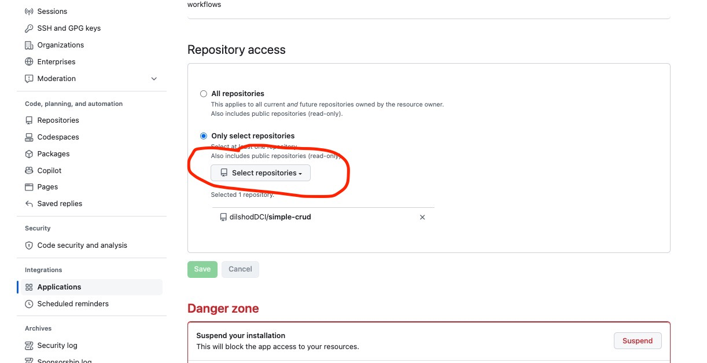
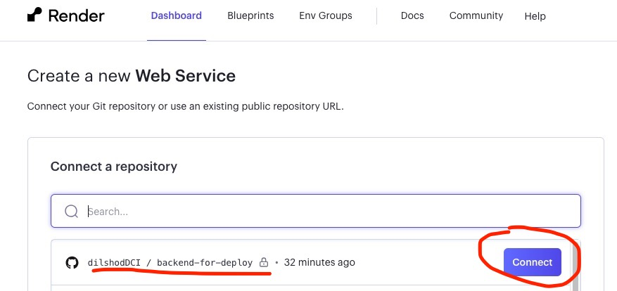
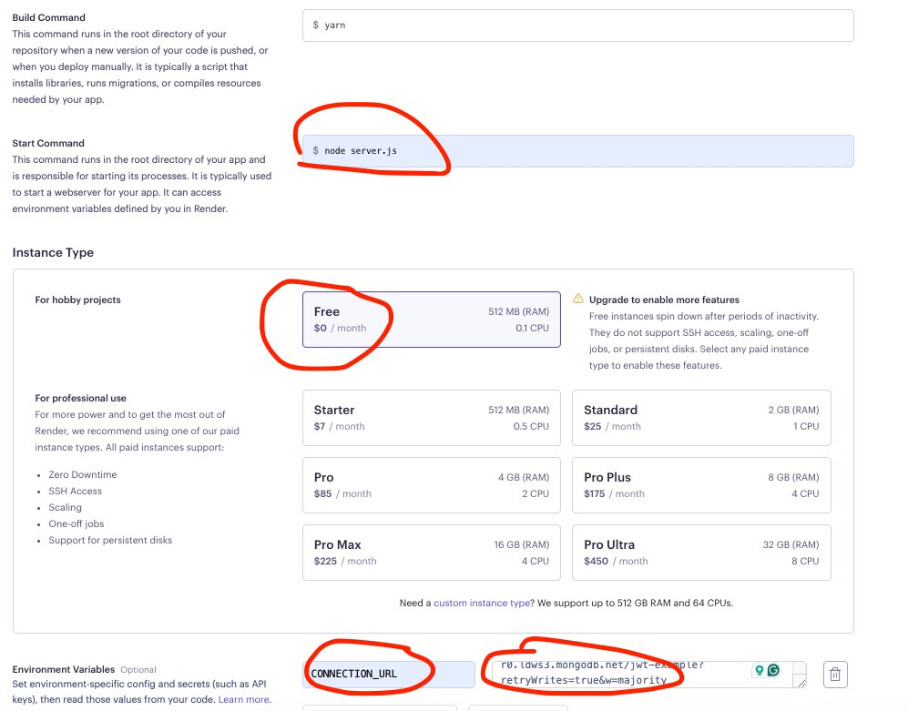

## How to deploy Backend project on Render.com?

To deploy a backend project on Render, you can follow these steps:

1. Create a new `Web Service` in your Render dashboard by clicking `+` button and selecting "Web Service".
   

2. Select `Build and deploy from Git repository` then press `Next button.`.

3. Next, in order to connect your backend repository select `Configure account`.
   

4. It will show you your GitHub user name. Select your user name. If you don't see it click on the dropdown arrow next to it and enter your username manually.
   

5. Scroll down to find `Repository access` in order to select backend project repository for deployment. After selecting repository press `Save` button. It will forward to Render Dashboard.
   

6. Select backend project repository to **Connect** it with the service.
   

7. Next add `Start Command` and `Environment Variables` according to your application requirements. Don't forget select `Free` plan.
   

8. Finally, press `Create Web Service` button.

**Done!**
